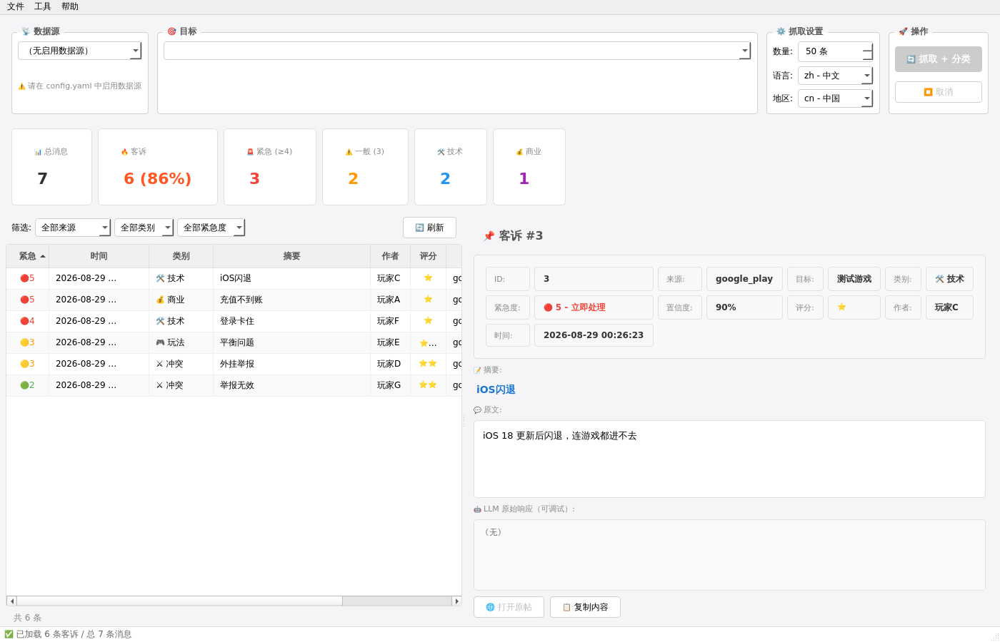
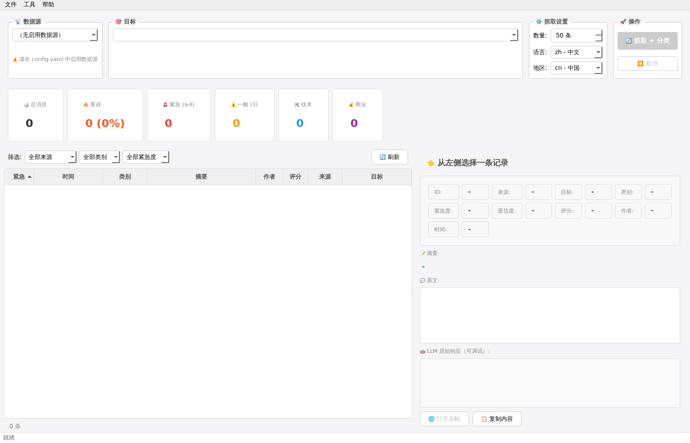
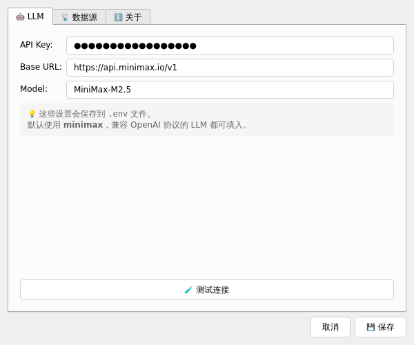

# Game Ops Monitor

游戏运营客诉自动监控系统。从 Google Play 评论区（即将支持 Discord）抓取玩家反馈，
用 LLM 自动判断是否为客诉并分类（游戏性 / 玩家争端 / 系统兼容 / 商业优化）。



## 特性

- ✅ **多数据源架构**：抽象 `DataSource` 接口，新增数据源（Discord、App Store、微博等）无需改主流程
- ✅ **LLM 驱动分类**：默认用 minimax M2.5（OpenAI 兼容），可切换任何兼容 OpenAI 协议的 LLM
- ✅ **本地优先**：SQLite 存储，无外部依赖，单机可跑
- ✅ **PyQt6 桌面 GUI**：多数据源切换、异步抓取、实时分类、筛选/排序/导出
- ✅ **CLI 备用**：完整命令行工具，方便脚本化
- ✅ **首启引导**：第一次启动自动弹设置，运营同事 GUI 填 API key
- ✅ **可打包 exe**：`python build.py` 一键出包，运营同事双击就能用

## 首次启动流程

1. 解压 → 双击 `GameOpsMonitor.exe`（或 `python -m src.gui_main`）
2. **自动弹出"欢迎"提示 + 设置对话框**
3. 填入你的 minimax API Key → 保存
4. 配置数据源（config.yaml 里加你的游戏包名）
5. 点"抓取+分类"，开干

| 主界面 | 设置对话框 |
|--------|-----------|
|  |  |

之后所有数据都保存在程序同目录的 `.env` 和 `data/monitor.db` 里。

## 当前进度

- [x] 核心架构 + DataSource 抽象
- [x] Google Play 抓取
- [x] LLM 分类（minimax）
- [x] SQLite 存储
- [x] CLI（fetch / show / detail / stats / export / sources）
- [x] PyQt6 桌面 GUI（数据源切换、列表、详情、筛选、异步抓取、设置）
- [x] 首启引导（自动检测 + 弹设置）
- [x] PyInstaller 打包配置（GUI + CLI 双版本，目录形式）
- [x] Discord 接入指南（代码占位）
- [ ] Discord Bot 实际实现（需用户提供 bot token）

## 快速开始

### 方式 A：直接跑（开发用）

```bash
cd game-ops-monitor
python -m venv .venv
source .venv/bin/activate  # Windows: .venv\Scripts\activate
pip install -r requirements.txt
pip install PyQt6

# 启动 GUI（首次会自动弹设置）
python -m src.gui_main
```

### 方式 B：打包成 exe（给运营同事用）

```bash
# 在 Windows 机器上：
pip install -r requirements.txt pyinstaller
python build.py
# 产物: dist/GameOpsMonitor/（目录形式，含 GameOpsMonitor.exe）
```

把 `dist/GameOpsMonitor/` 整个目录打包成 zip 发给同事，同事解压后：
- 双击 `GameOpsMonitor.exe` 启动
- 首次自动弹设置，填 API key
- 数据存到程序目录的 `data/monitor.db`

详细打包说明见 [`BUILD.md`](./BUILD.md)。

## GUI 功能

- **首启引导**：未配置 API key 自动弹设置
- **数据源切换**：Google Play / Discord 顶部下拉切换
- **多目标管理**：配置文件中可加多个游戏/频道
- **一键抓取**：点击"抓取+分类"按钮，后台异步执行，进度条实时显示
- **智能筛选**：按来源/类别/紧急度筛选列表
- **紧急度排序**：🔴 红 / 🟡 黄 / 🟢 绿 一目了然
- **详情面板**：选中行后展示完整内容、LLM 分析、原始响应
- **跳转原帖**：点击"打开原帖"直接浏览器跳转
- **统计概览**：顶部 6 张卡片展示总消息/客诉/紧急/各类别
- **导出 CSV/JSON**：菜单 → 文件 → 导出
- **设置面板**：菜单 → 工具 → 设置（在线改 API key、编辑 config.yaml、测试 LLM）

## CLI 命令（备用）

```bash
# 抓取
python -m src.cli fetch --source google_play --target <package_name> --limit 50

# 查看客诉
python -m src.cli show --min-urgency 3
python -m src.cli show --category tech
python -m src.cli detail <id>

# 导出 / 统计
python -m src.cli export --output report.csv
python -m src.cli stats
python -m src.cli sources
```

## 配置多游戏

编辑 `config.yaml`：

```yaml
sources:
  google_play:
    enabled: true
    targets:
      - id: com.supercell.clashroyale
        name: 部落冲突
        country: cn
        lang: zh
      - id: com.supercell.brawlstars
        name: 荒野乱斗
        country: cn
        lang: zh
```

GUI 会自动列出所有 `enabled: true` 的目标。

## Discord 接入（待实现）

Discord 走 Bot API，参见 [`DISCORD_SETUP.md`](./DISCORD_SETUP.md)。

代码侧只需新增 `src/sources/discord.py` 实现 `DataSource` 接口，
主流程（分类、存储、CLI、GUI）**无需任何改动**——GUI 会自动出现 Discord 数据源选项。

## 架构

```
┌──────────────────────────────────────────┐
│          DataSource 抽象层                 │
│   (GooglePlay / Discord / AppStore)      │
└─────────────┬────────────────────────────┘
              │ RawMessage
              ▼
┌──────────────────────────────────────────┐
│       LLM Classifier                      │
│  (is_complaint / category / urgency)     │
└─────────────┬────────────────────────────┘
              │ ClassificationResult
              ▼
┌──────────────────────────────────────────┐
│       SQLite Storage                      │
└─────────────┬────────────────────────────┘
              │
              ▼
┌──────────────────────────────────────────┐
│   PyQt6 GUI  /  CLI                       │
└──────────────────────────────────────────┘
```

## 分类规则

参考 [`src/classifier/llm.py`](./src/classifier/llm.py) 中的 prompt。可针对具体游戏调优。

默认四类：
- `gameplay` - 游戏性问题（数值、平衡、玩法、剧情）
- `conflict` - 玩家间冲突（骂人、PVP 不公、外挂举报）
- `tech` - 系统兼容性（闪退、卡顿、崩溃、登录）
- `monetization` - 商业相关（充值不到账、定价、活动）

紧急度 1-5：
- 1: 轻微吐槽
- 2: 一般抱怨
- 3: 明显不满
- 4: 爆发风险
- 5: 已造成损失/群体性

## 项目结构

```
game-ops-monitor/
├── src/
│   ├── models/             # 数据模型
│   ├── sources/            # 数据源（DataSource 抽象 + 实现）
│   ├── classifier/         # LLM 分类器
│   ├── storage/            # SQLite 存储
│   ├── gui/                # PyQt6 GUI
│   │   ├── main_window.py
│   │   ├── widgets/        # 各个面板
│   │   └── workers/        # 异步抓取
│   ├── cli.py              # CLI 入口
│   ├── gui_main.py         # GUI 入口
│   └── config.py
├── tests/                  # 测试
├── scripts/                # 工具脚本
├── docs/                   # 截图
├── config.yaml             # 数据源/游戏配置
├── game_ops_monitor.spec   # PyInstaller GUI 打包配置
├── cli.spec                # PyInstaller CLI 打包配置
├── build.py                # 一键打包
├── README.md
├── DISCORD_SETUP.md        # Discord 接入指南
└── BUILD.md                # 打包说明
```

## License

MIT
